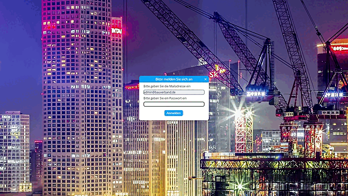

# Handbuch
Auf dieser Seite werden verschiedene Funktionen des Dashboards per Video vorgeführt und beschrieben. Funktionen des Dashboards stehen nur dann zur Verfügung, wenn man sich im System [angemeldet hat](TODO). Ist man nicht angemeldet, hat die Möglichkeit die verschiedenen [Dashboardseiten](TODO) zu betrachten.

## Basics
Hier werden die Anmelde und Abmelde-Abläufe, sowie die Seitenverwaltung vorgestellt.

### Login & Logout   
Um sich auf einer Seite anzumelden, muss der Nutzer zuvor von einem Administrator hinterlegt worden sein. Ist der Nutzer bereits im System hinterlegt, kann er sich mit seiner E-Mail Adresse und dem dazugehörigen Passwort anmelden. Ist er angemeldet, hat er Zugang zu den verschiedenen Funktionen als Administrator. Hierzu gehören beispielsweise das Erstellen neuer Dashboardseiten, Anpassen der Prognosen oder Verwalten von Nutzern.
Möchte sich der Nutzer wieder abmelden, so findet er rechts oben der Logout-Button. Ist der Nutzer abgemeldet, so hat er nur noch Zugang zur öffentlichen Seite des Dashboards, welche verschiedene Dashboardseiten mit den dazugehörigen Kacheln visualisiert.

   

 

### Seiten Verwaltung
In der Sidebar hat der Nutzer die Möglichkeit neue Seiten zu erstellen, in dem er das Element "Seite hinzufügen" klickt. Möchte man eine Seite umbenennen, so kann man das Stift-Symbol anklicken und sie im anschließend öffnenden Dialog umbenennen. In dem man auf das Mülleimer Symbol klickt, kann man eine Seite vollständig löschen. 

## Dashboardseite 
### Dashboardseite Basic  
Auf dieser Seite kann der Nutzer zwischen den verschiedenen Dashboardseiten auswählen, auf welchen die erstellten Kacheln zu sehen sind.

 

## Adminseite
### Freitext erstellen  
 

### KPI erstellen
 

### Diagramm erstellen
 

### Diagramm oder KPI bearbeiten
Um eine bestimmte Kachel zu bearbeiten, kann der Nutzer über den 

## Prognoseseite
Auf dieser Seite können Prognosen genauer betrachtet werden und optional angepasst werden.

### Prognoseseite Basic

### Prognose manuell anpassen
  

## User Administration  
Auf dieser Seite werden die verschiedenen Nutzer verwaltet. Nutzer können hinzugefügt oder gelöscht werden.

